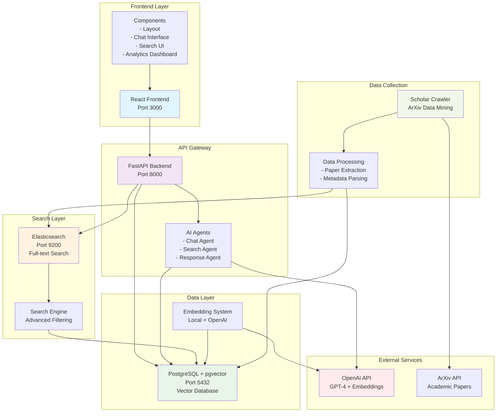

# Research Assistant Chatbot

A sophisticated AI-powered research assistant platform that revolutionizes how researchers discover, analyze, and understand academic papers from arXiv. Built with modern microservices architecture, advanced AI agents, and powerful search capabilities.

## 🚀 Overview

This comprehensive research platform combines cutting-edge AI technology with robust search capabilities to provide:

- **🤖 AI-Powered Conversations**: Multi-agent system for intelligent research assistance
- **🔍 Advanced Search**: Hybrid search combining semantic similarity and full-text search
- **📊 Research Analytics**: Deep insights into research trends and patterns
- **🎯 Semantic Understanding**: Vector embeddings for contextual paper discovery
- **⚡ Real-time Processing**: Fast, responsive user experience
- **🔄 Continuous Learning**: Adaptive system that improves over time

## 🏗️ System Architecture

### Architecture Overview



### Core Components

#### 1. Frontend Layer (`frontend/`)
**Technology**: React 18, Tailwind CSS, TypeScript
- **Modern UI/UX**: Responsive design with dark/light theme support
- **Interactive Chat**: Real-time conversational interface
- **Advanced Search**: Multi-filter search with live results
- **Analytics Dashboard**: Visual insights and research trends
- **Session Management**: Persistent chat history and context

#### 2. Backend API (`backend/`)
**Technology**: FastAPI, SQLAlchemy, Python 3.9+
- **High-Performance API**: Async FastAPI with automatic OpenAPI documentation
- **AI Agent System**: Multi-agent architecture for specialized tasks
- **Vector Search**: PostgreSQL with pgvector for similarity search
- **Session Management**: Persistent chat sessions with context awareness
- **Advanced Analytics**: Research trend analysis and insights

#### 3. Search Engine (`search_engine/`)
**Technology**: Elasticsearch, FastAPI, Docker
- **Full-Text Search**: Advanced text search with relevance scoring
- **Flexible Filtering**: Date ranges, categories, authors, keywords
- **Performance Optimized**: Connection pooling and query optimization
- **Multi-Format Support**: Various date formats and search patterns
- **Scalable Architecture**: Containerized deployment with monitoring

#### 4. Data Collection (`scholar_crawler/`)
**Technology**: Python, Scrapy, Docker
- **ArXiv Integration**: Direct API access to arXiv papers
- **Automated Crawling**: Scheduled data collection and updates
- **Data Processing**: Metadata extraction and normalization
- **Quality Assurance**: Data validation and integrity checks
- **Scalable Processing**: Batch processing with error handling

#### 5. Embedding System (`embedding/`)
**Technology**: OpenAI API, Local Models, Vector Processing
- **Hybrid Approach**: Local and cloud-based embedding generation
- **Performance Optimized**: CPU and GPU acceleration support
- **Cost Effective**: Intelligent caching and batch processing
- **Quality Assured**: Embedding validation and monitoring
- **Scalable Processing**: Parallel processing for large datasets

#### 6. Database Layer (`postgres/`)
**Technology**: PostgreSQL 13+, pgvector, Redis (optional)
- **Vector Database**: High-performance similarity search
- **ACID Compliance**: Reliable data consistency
- **Advanced Indexing**: Composite indexes for query optimization
- **Connection Pooling**: Efficient resource management
- **Backup Strategy**: Automated backups and recovery

## 🎯 Key Features

### 🤖 AI-Powered Research Assistant
- **Multi-Agent Architecture**: Specialized agents for different research tasks
- **Context-Aware Conversations**: Maintains research context across sessions
- **Intelligent Query Understanding**: Natural language processing for research queries
- **Research Trend Analysis**: AI-powered insights into emerging research areas
- **Collaboration Network Analysis**: Understanding author relationships and collaborations

### 🔍 Advanced Search Capabilities
- **Semantic Search**: Vector similarity for contextual paper discovery
- **Full-Text Search**: Elasticsearch-powered text search with relevance scoring
- **Hybrid Search Strategy**: Combines multiple search approaches for optimal results
- **Smart Filtering**: Year, category, author, and keyword-based filtering
- **Research Landscape Analysis**: Comprehensive field analysis and insights

### 📊 Analytics and Insights
- **Research Trends**: Temporal analysis of research patterns
- **Category Analytics**: Deep dive into research categories and evolution
- **Author Networks**: Collaboration patterns and research communities
- **Performance Metrics**: Search analytics and user behavior insights
- **Data Visualization**: Interactive charts and graphs for research insights

### 🎨 User Experience
- **Responsive Design**: Mobile-first approach with cross-device compatibility
- **Dark/Light Theme**: Automatic theme detection with manual override
- **Real-time Updates**: Live search results and chat responses
- **Session Management**: Persistent conversations with history
- **Accessibility**: WCAG-compliant design for inclusive access

## 🛠️ Technology Stack

### Frontend Technologies
```
React 18.2.0          # Modern UI framework
Tailwind CSS 3.4.1    # Utility-first CSS framework
TypeScript            # Type-safe JavaScript
React Router 6.22.1   # Client-side routing
Heroicons 2.1.1       # Beautiful SVG icons
Headless UI 1.7.18    # Unstyled accessible components
Axios 1.6.7           # HTTP client
React Markdown 9.0.1  # Markdown rendering
```

### Backend Technologies
```
FastAPI 0.68.1        # High-performance web framework
SQLAlchemy 1.4.23     # Database ORM
PostgreSQL 13+        # Primary database
pgvector 0.2.3        # Vector similarity search
OpenAI API 0.27.0     # AI language model
Alembic 1.7.7         # Database migrations
Uvicorn 0.15.0        # ASGI server
```

### Search Technologies
```
Elasticsearch 8+      # Full-text search engine
Python 3.9+          # Search engine implementation
Docker               # Containerization
Logstash (optional)  # Log processing
```

### Data Processing
```
Python 3.9+          # Data processing
Scrapy               # Web scraping framework
NumPy 1.21.2         # Numerical computing
Pandas 1.3.3         # Data manipulation
Scikit-learn 0.24.2  # Machine learning
```

### Infrastructure
```
Docker & Docker Compose  # Containerization
PostgreSQL 13+          # Database system
Redis (optional)        # Caching layer
Nginx (optional)        # Reverse proxy
```

## 📋 Prerequisites

### System Requirements
- **Operating System**: Linux, macOS, or Windows (WSL2 recommended)
- **Memory**: 8GB RAM minimum, 16GB recommended
- **Storage**: 10GB available space
- **Network**: Stable internet connection for API access

### Software Dependencies
- **Docker**: 20.10+ and Docker Compose v2
- **Node.js**: 18+ LTS version
- **Python**: 3.9+ with pip
- **Git**: For version control

### API Keys
- **OpenAI API Key**: Required for AI features and embeddings
- **ArXiv API Access**: For paper data (usually no key required)

## 🚀 Quick Start

### 1. Clone and Setup
```bash
# Clone the repository
git clone https://github.com/your-username/research-assistant-chatbot.git
cd research-assistant-chatbot

# Create environment file
cp .env.example .env
# Edit .env with your configuration (especially OpenAI API key)
```

### 2. Environment Configuration
Create a `.env` file in the root directory:
```env
# Database Configuration
POSTGRES_USER=postgres
POSTGRES_PASSWORD=your_secure_password
POSTGRES_DB=research_assistant

# OpenAI Configuration
OPENAI_API_KEY=your_openai_api_key_here

# Application Configuration
REACT_APP_API_URL=http://localhost:8000
DEBUG=false

# Optional: Search Engine
ELASTICSEARCH_URL=http://localhost:9200
```

### 3. Quick Start with Docker
```bash
# Build and start all services
docker-compose up --build

# Wait for services to be ready, then access:
# Frontend: http://localhost:3000
# Backend API: http://localhost:8000
# API Docs: http://localhost:8000/docs
# Search Engine: http://localhost:9200
```

### 4. Initialize with Sample Data
```bash
# Initialize database
docker-compose exec backend python init_db.py

# Generate embeddings (optional but recommended)
docker-compose exec backend python generate_embeddings.py

# Or run from host
python run_local_embeddings.py
```

## 🔧 Development Setup

### Backend Development
```bash
cd backend

# Create virtual environment
python -m venv venv
source venv/bin/activate  # Windows: venv\Scripts\activate

# Install dependencies
pip install -r requirements.txt

# Start development server
uvicorn main:app --reload --host 0.0.0.0 --port 8000
```

### Frontend Development
```bash
cd frontend

# Install dependencies
npm install

# Start development server
npm start
```

### Search Engine Development
```bash
cd search_engine

# Start Elasticsearch
docker-compose up elasticsearch

# Run search engine
python app/main.py
```

### Data Collection Development
```bash
cd scholar_crawler

# Install dependencies
pip install -r requirements.txt

# Run crawler
python src/main.py
```

## 📊 Database Schema

### ArXiv Papers Table
```sql
CREATE TABLE arxiv (
    id SERIAL PRIMARY KEY,
    arxiv_id VARCHAR(50) UNIQUE NOT NULL,
    title VARCHAR(500) NOT NULL,
    abstract TEXT,
    authors TEXT[],
    categories TEXT[],
    published_date TIMESTAMP,
    updated_date TIMESTAMP,
    doi VARCHAR(100),
    journal_ref VARCHAR(500),
    primary_category VARCHAR(50),
    comment TEXT,
    embedding VECTOR(1536),  -- OpenAI embeddings
    
    -- Indexes for performance
    CONSTRAINT unique_arxiv_id UNIQUE (arxiv_id)
);

-- Performance indexes
CREATE INDEX idx_arxiv_published_date ON arxiv(published_date);
CREATE INDEX idx_arxiv_primary_category ON arxiv(primary_category);
CREATE INDEX idx_arxiv_title_gin ON arxiv USING gin(to_tsvector('english', title));
CREATE INDEX idx_arxiv_embedding ON arxiv USING hnsw (embedding vector_cosine_ops);
```

### Chat Sessions Table
```sql
CREATE TABLE chat_sessions (
    id SERIAL PRIMARY KEY,
    session_id VARCHAR(50) UNIQUE NOT NULL,
    messages JSONB DEFAULT '[]',
    context JSONB DEFAULT '{}',
    created_at TIMESTAMP DEFAULT NOW(),
    updated_at TIMESTAMP DEFAULT NOW()
);

-- Indexes
CREATE INDEX idx_chat_sessions_session_id ON chat_sessions(session_id);
CREATE INDEX idx_chat_sessions_created_at ON chat_sessions(created_at);
```

## 🔌 API Endpoints

### Chat Endpoints
- `POST /api/chat` - Process chat messages with AI agents
- `POST /enhanced-chat` - Enhanced chat with advanced features
- `POST /research-landscape` - Research landscape analysis
- `POST /smart-search` - Intelligent search with AI

### Search Endpoints
- `POST /api/search` - Search papers with advanced filters
- `GET /category-analysis/{category}` - Analyze specific research category
- `GET /category-suggestions` - Get research category suggestions
- `GET /search-analytics` - Retrieve search analytics

### Session Management
- `GET /api/sessions` - List all chat sessions
- `GET /api/sessions/{session_id}` - Get specific session
- `DELETE /api/sessions/{session_id}` - Delete session
- `PUT /api/sessions/{session_id}` - Update session

### System Endpoints
- `GET /api/health` - Health check
- `GET /` - API information

## 🎨 UI Components

### Core Components
```
Layout.js              # Main application layout
ChatMessage.js          # Individual chat message
ChatSessions.js         # Session management
ArxivCard.js           # Paper display card
```

### Pages
```
Home.js                # Landing page
Chat.js                # Chat interface
Search.js              # Search interface
DatasetInsights.js     # Analytics dashboard
```

### Features
- **Responsive Design**: Mobile-first with Tailwind CSS
- **Theme Support**: Dark/light mode with system preference
- **Real-time Updates**: Live search and chat responses
- **Accessibility**: WCAG-compliant components
- **Performance**: Optimized rendering and state management

## 🔍 Search Capabilities

### Search Types
1. **Semantic Search**: Vector similarity using embeddings
2. **Full-Text Search**: Elasticsearch-powered text search
3. **Hybrid Search**: Combined approach for optimal results
4. **Category Search**: ArXiv category-based filtering
5. **Temporal Search**: Date range and trend analysis

### Advanced Features
- **Smart Fallback**: Automatic strategy switching
- **Category Hierarchy**: Understanding research relationships
- **Author Networks**: Collaboration analysis
- **Trend Detection**: Emerging research areas
- **Research Gaps**: Identifying unexplored areas

## 📈 Performance Optimization

### Backend Optimizations
- **Connection Pooling**: Database connection management
- **Query Optimization**: Efficient database queries
- **Caching Strategy**: Redis for frequently accessed data
- **Async Processing**: Non-blocking operations
- **Resource Management**: Memory and CPU optimization

### Frontend Optimizations
- **Code Splitting**: Route-based lazy loading
- **Memoization**: Preventing unnecessary re-renders
- **Bundle Optimization**: Tree shaking and minification
- **Caching**: Browser and API response caching
- **Performance Monitoring**: Real-time performance tracking

### Search Optimizations
- **Index Optimization**: Efficient Elasticsearch indexes
- **Query Optimization**: Optimized search queries
- **Result Caching**: Frequently searched results
- **Parallel Processing**: Concurrent search operations
- **Load Balancing**: Distributed search processing

## 🚨 Troubleshooting

### Common Issues

#### 1. Database Connection Issues
```bash
# Check database status
docker-compose ps postgres

# Reset database
docker-compose down -v
docker-compose up postgres

# Check logs
docker-compose logs postgres
```

#### 2. Embedding Generation Issues
```bash
# Check OpenAI API key
echo $OPENAI_API_KEY

# Test embedding generation
python -c "from embedding import test_embeddings; test_embeddings()"

# Generate embeddings manually
python run_local_embeddings.py
```

#### 3. Search Engine Issues
```bash
# Check Elasticsearch status
curl http://localhost:9200/_health

# Restart search engine
docker-compose restart elasticsearch

# Check search engine logs
docker-compose logs search_engine
```

#### 4. Frontend Issues
```bash
# Clear cache and reinstall
cd frontend
rm -rf node_modules package-lock.json
npm install

# Check API connection
curl http://localhost:8000/api/health
```

### Debug Mode
Enable debug mode for detailed logging:
```env
DEBUG=true
LOG_LEVEL=DEBUG
```

## 🔒 Security Considerations

### API Security
- **CORS Configuration**: Properly configured cross-origin requests
- **Input Validation**: Pydantic models for request validation
- **SQL Injection Prevention**: SQLAlchemy ORM protection
- **Rate Limiting**: API endpoint protection
- **Authentication**: JWT-based authentication (optional)

### Data Security
- **Environment Variables**: Secure configuration management
- **API Key Protection**: Never expose API keys in code
- **Database Security**: Encrypted connections and backups
- **Data Validation**: Input sanitization and validation
- **Privacy**: User data protection and anonymization

## 📚 Documentation

### Component Documentation
- [`backend/README.md`](./backend/README.md) - Backend API documentation
- [`frontend/README.md`](./frontend/README.md) - Frontend application guide
- [`embedding/README.md`](./embedding/README.md) - Embedding system guide
- [`scholar_crawler/README.md`](./scholar_crawler/README.md) - Data collection guide

### Advanced Guides
- [`backend/ENHANCED_SEARCH_GUIDE.md`](./backend/ENHANCED_SEARCH_GUIDE.md) - Advanced search features
- [`backend/README_EMBEDDINGS.md`](./backend/README_EMBEDDINGS.md) - Embedding generation
- [`embedding/PERFORMANCE_OPTIMIZATION.md`](./embedding/PERFORMANCE_OPTIMIZATION.md) - Performance tuning

## 🤝 Contributing

### Development Workflow
1. Fork the repository
2. Create a feature branch: `git checkout -b feature/amazing-feature`
3. Make your changes with tests
4. Commit: `git commit -m 'Add amazing feature'`
5. Push: `git push origin feature/amazing-feature`
6. Submit a Pull Request

### Code Standards
- **Python**: Follow PEP 8 with Black formatting
- **JavaScript**: ESLint and Prettier configuration
- **Git**: Conventional commit messages
- **Documentation**: Update relevant README files
- **Testing**: Include tests for new features

### Architecture Guidelines
- **Microservices**: Maintain service boundaries
- **API Design**: RESTful principles
- **Error Handling**: Consistent error responses
- **Performance**: Consider scalability in design
- **Security**: Follow security best practices

## 📄 License

This project is licensed under the MIT License - see the [LICENSE](LICENSE) file for details.

## 🙏 Acknowledgments

- **arXiv**: For providing the research paper dataset
- **OpenAI**: For GPT-4 and embedding services
- **FastAPI**: For the excellent web framework
- **React**: For the frontend framework
- **PostgreSQL**: For the robust database system
- **Elasticsearch**: For powerful search capabilities
- **Tailwind CSS**: For the utility-first CSS framework

## 📞 Support

For support and questions:
- 📖 Check the comprehensive documentation
- 🔍 Search existing issues on GitHub
- 💬 Join our community discussions
- 🐛 Report bugs with detailed reproduction steps
- 💡 Suggest features and improvements

## 🗺️ Roadmap

### Upcoming Features
- **Real-time Collaboration**: Multi-user research sessions
- **Advanced Analytics**: Machine learning-powered insights
- **Mobile App**: Native mobile applications
- **API Integrations**: Connect with other research tools
- **Enhanced AI**: More sophisticated research assistance

### Performance Improvements
- **Caching Layer**: Redis implementation
- **Load Balancing**: Distributed architecture
- **Database Optimization**: Advanced indexing strategies
- **Search Enhancement**: Improved relevance algorithms
- **UI/UX Improvements**: Enhanced user experience

---

**Built with ❤️ by the Research Assistant Team**

*Empowering researchers with AI-powered discovery and analysis tools* 