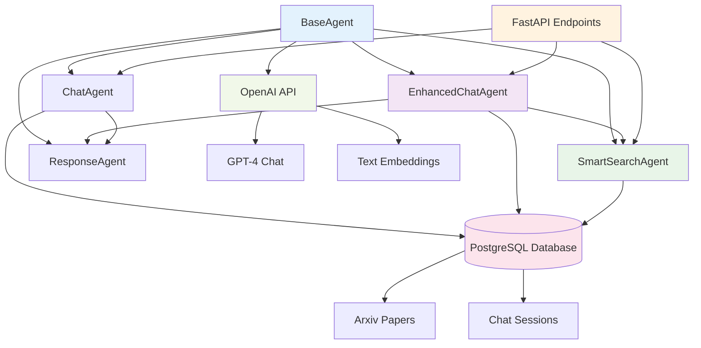
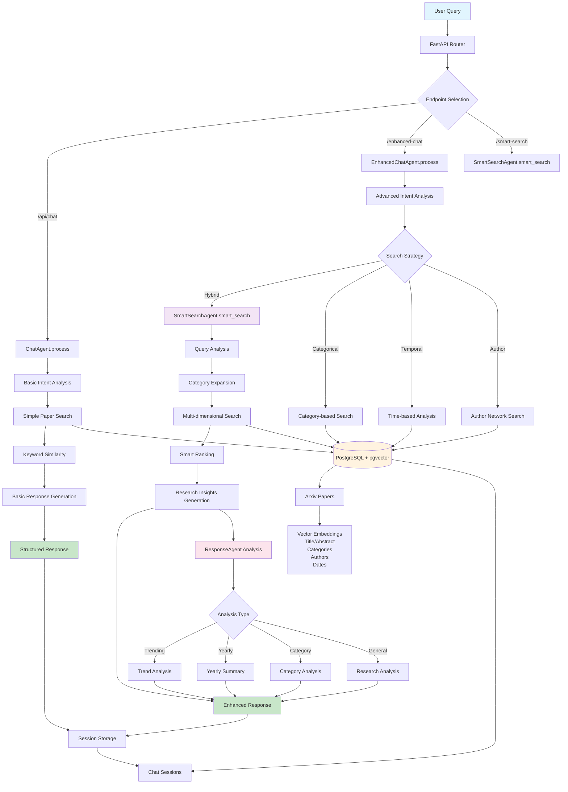

# Research Assistant Backend - Agent Architecture Documentation

## 🏗️ System Overview

The Research Assistant backend is built around a sophisticated multi-agent architecture designed to process user queries, search academic papers, and generate intelligent responses. The system leverages ArXiv papers stored in a PostgreSQL database with vector embeddings for semantic search.

### Key Technologies
- **Framework**: FastAPI (Python)
- **Database**: PostgreSQL with pgvector extension
- **AI**: OpenAI GPT-4 and text-embedding-ada-002
- **ORM**: SQLAlchemy with async support
- **Vector Search**: pgvector for semantic similarity

## 🤖 Agent Architecture

### Agent Hierarchy

```
BaseAgent
├── ChatAgent (Basic chat functionality)
├── EnhancedChatAgent (Advanced chat with smart search)
├── SmartSearchAgent (Sophisticated search capabilities)
└── ResponseAgent (Response generation and analysis)
```

### Agent Relationship Diagram



## 🔧 Core Agents

### 1. BaseAgent (`agents/base_agent.py`)

**Purpose**: Foundation class providing common functionality for all agents.

**Key Features**:
- OpenAI API integration (GPT-4 and embeddings)
- Conversation history management
- Intent analysis capabilities
- Logging and error handling

**Core Methods**:
```python
async def get_embedding(text: str) -> List[float]
async def generate_completion(messages: List[Dict], temperature=0.7) -> str
async def analyze_intent(query: str) -> Dict[str, Any]
```

---

### 2. ChatAgent (`agents/chat_agent.py`)

**Purpose**: Basic chat functionality with paper search capabilities.

**Key Features**:
- Session management integration
- Basic intent analysis
- ArXiv paper search using metadata and embeddings
- Keyword-based similarity scoring
- Response generation with structured formatting

**Process Flow**:
1. **Intent Analysis** → Determines if search is needed
2. **Paper Search** → Semantic + metadata search
3. **Similarity Calculation** → Multi-factor scoring
4. **Response Generation** → Structured markdown response

**Search Strategy**:
- Semantic search using embeddings (when available)
- Keyword matching in title/abstract (40% weight)
- Category matching (20% weight)
- Author matching (10% weight)
- Recency boost for newer papers

---

### 3. EnhancedChatAgent (`agents/enhanced_chat_agent.py`)

**Purpose**: Advanced chat agent with sophisticated intent analysis and smart search integration.

**Key Features**:
- **Multi-Strategy Search**: Semantic, categorical, temporal, author-based
- **Advanced Intent Analysis**: Uses GPT-4 for comprehensive query understanding
- **Research Insights**: Generates detailed analysis and recommendations
- **Token Optimization**: Efficient handling of large paper datasets
- **Rich Response Formatting**: Structured HTML and markdown output

**Intent Analysis Categories**:
- `paper_search`: General paper search
- `trend_analysis`: Research trend analysis
- `author_analysis`: Author-focused queries
- `category_exploration`: Field exploration
- `comparison`: Comparative analysis
- `general_question`: Non-search queries

**Search Strategies**:
- **Hybrid**: Combines multiple approaches (default)
- **Categorical**: Category-focused search
- **Temporal**: Time-based analysis
- **Author-based**: Author collaboration analysis

---

### 4. SmartSearchAgent (`agents/smart_search_agent.py`)

**Purpose**: Sophisticated search engine with hierarchical category understanding and advanced filtering.

**Key Features**:
- **Category Hierarchy**: Understanding of ArXiv's complex category structure
- **Temporal Analysis**: Smart handling of time-based queries
- **Author Networks**: Collaboration pattern analysis
- **Multi-dimensional Scoring**: Combines semantic, categorical, and temporal factors
- **Research Landscape Analysis**: Comprehensive field analysis

**Category Hierarchy Example**:
```python
{
    "cs": ["cs.AI", "cs.LG", "cs.CV", "cs.CL", ...],
    "math": ["math.AG", "math.NT", "math.PR", ...],
    "physics": ["physics.gen-ph", "quant-ph", ...]
}
```

**Smart Search Process**:
1. **Query Analysis** → Extract categories, years, authors
2. **Category Expansion** → Include related subcategories
3. **Multi-Strategy Search** → Semantic + categorical + temporal
4. **Smart Ranking** → Advanced similarity calculation
5. **Result Optimization** → Token-aware result limiting

---

### 5. ResponseAgent (`agents/response_agent.py`)

**Purpose**: Specialized response generation with detailed analysis capabilities.

**Key Features**:
- **Analysis Types**: Trending topics, yearly summaries, category analysis
- **Embedding Analysis**: Semantic similarity insights
- **Structured Responses**: Template-based response generation
- **Research Insights**: Pattern recognition and trend analysis

**Response Types**:
- `trending_topics`: Popular research areas
- `yearly_summary`: Annual research overview
- `category_analysis`: Field-specific analysis
- `analysis`: General research analysis

## 🗄️ Database Architecture

### Models

#### Arxiv Model
```python
class Arxiv(Base):
    id: Integer (Primary Key)
    arxiv_id: String (Unique)
    title: String (Indexed)
    abstract: Text
    authors: ARRAY[String]
    categories: ARRAY[String]
    published_date: DateTime (Indexed)
    updated_date: DateTime
    doi: String
    journal_ref: String
    primary_category: String
    comment: Text
    embedding: Vector(1536)  # OpenAI embeddings
```

#### ChatSession Model
```python
class ChatSession(Base):
    id: Integer (Primary Key)
    session_id: String (Unique)
    messages: JSONB
    context: JSONB
    created_at: DateTime
    updated_at: DateTime
```

### Database Functions
- `cosine_similarity(a vector, b vector)`: Calculate semantic similarity
- `array_to_vector(arr numeric[])`: Convert arrays to vectors

## 🔄 System Flow

### System Architecture Diagram



### Flow Descriptions

### 1. Basic Chat Flow
```
User Query → ChatAgent.process() → Intent Analysis → Paper Search → Response Generation → User Response
```

### 2. Enhanced Chat Flow
```
User Query → EnhancedChatAgent.process() → Advanced Intent Analysis → SmartSearchAgent.smart_search() → Research Insights → Enhanced Response
```

### 3. Smart Search Flow
```
Query → Query Analysis → Category Expansion → Multi-Strategy Search → Smart Ranking → Optimized Results
```

## 🌐 API Endpoints

### Core Endpoints

#### `/api/chat` (POST)
- **Purpose**: Basic chat functionality
- **Agent**: ChatAgent
- **Features**: Session management, basic search

#### `/enhanced-chat` (POST)
- **Purpose**: Advanced chat with smart search
- **Agent**: EnhancedChatAgent
- **Features**: Advanced intent analysis, research insights

#### `/smart-search` (POST)
- **Purpose**: Direct smart search
- **Agent**: SmartSearchAgent
- **Features**: Category hierarchy, temporal analysis

### Utility Endpoints

#### `/api/search` (POST)
- Basic paper search with year/keyword filters

#### `/research-landscape` (POST)
- Research landscape analysis for categories

#### `/category-analysis/{category}` (GET)
- Detailed category analysis

#### `/category-suggestions` (GET)
- Available categories and search tips

#### `/search-analytics` (GET)
- Database statistics and search capabilities

## 💡 Key Features

### 1. Multi-Strategy Search
- **Semantic**: Vector similarity using embeddings
- **Categorical**: Hierarchy-aware category matching
- **Temporal**: Time-based filtering and trends
- **Metadata**: Author, journal, DOI matching

### 2. Intelligent Fallback
When embeddings aren't available:
- Switches to keyword-based search
- Uses category hierarchy expansion
- Applies temporal and metadata filtering

### 3. Token Optimization
- Efficient paper truncation for large datasets
- Smart context management
- Response size optimization

### 4. Research Insights
- Trend analysis across time periods
- Category distribution analysis
- Author collaboration patterns
- Research gap identification

## 🚀 Usage Examples

### Basic Chat
```python
response = await chat_agent.process({
    "query": "machine learning papers from 2023",
    "session_id": "user-session-123",
    "context": {}
})
```

### Enhanced Chat
```python
response = await enhanced_chat_agent.process({
    "query": "What are the recent trends in transformer architectures?",
    "context": {"analysis_type": "trend_analysis"},
    "session_id": "user-session-123"
})
```

### Smart Search
```python
papers = await smart_search_agent.smart_search(
    "quantum computing applications",
    {"categories": ["cs.CC", "quant-ph"], "temporal_scope": "recent"}
)
```

## 🔧 Configuration

### Environment Variables
- `OPENAI_API_KEY`: OpenAI API key
- `DB_HOST`, `DB_PORT`, `DB_NAME`: Database configuration
- `DB_USER`, `DB_PASSWORD`: Database credentials

### Prompts Configuration
Stored in `config/prompts.py`:
- System prompts for each agent
- Response templates
- Analysis prompts

## 📊 Performance Features

### Database Optimizations
- Composite indexes on common query patterns
- Vector similarity functions
- Connection pooling

### Search Optimizations
- Category hierarchy caching
- Smart result limiting
- Parallel query execution
- Token-aware processing

## 🛠️ Extending the System

### Adding New Agents
1. Inherit from `BaseAgent`
2. Implement `process()` method
3. Add agent-specific functionality
4. Register in main.py

### Adding New Search Strategies
1. Implement in `SmartSearchAgent`
2. Add strategy detection in `EnhancedChatAgent`
3. Update intent analysis prompts

### Adding New Response Types
1. Add templates in `config/prompts.py`
2. Implement analysis logic in `ResponseAgent`
3. Update type detection logic

## 🔍 Monitoring & Debugging

### Logging
- Comprehensive logging throughout agents
- Request/response tracking
- Error handling with context

### Analytics
- Search pattern analysis
- Database usage statistics
- Agent performance metrics

---

This architecture provides a robust, scalable foundation for research assistance with intelligent search capabilities and comprehensive analysis features. 