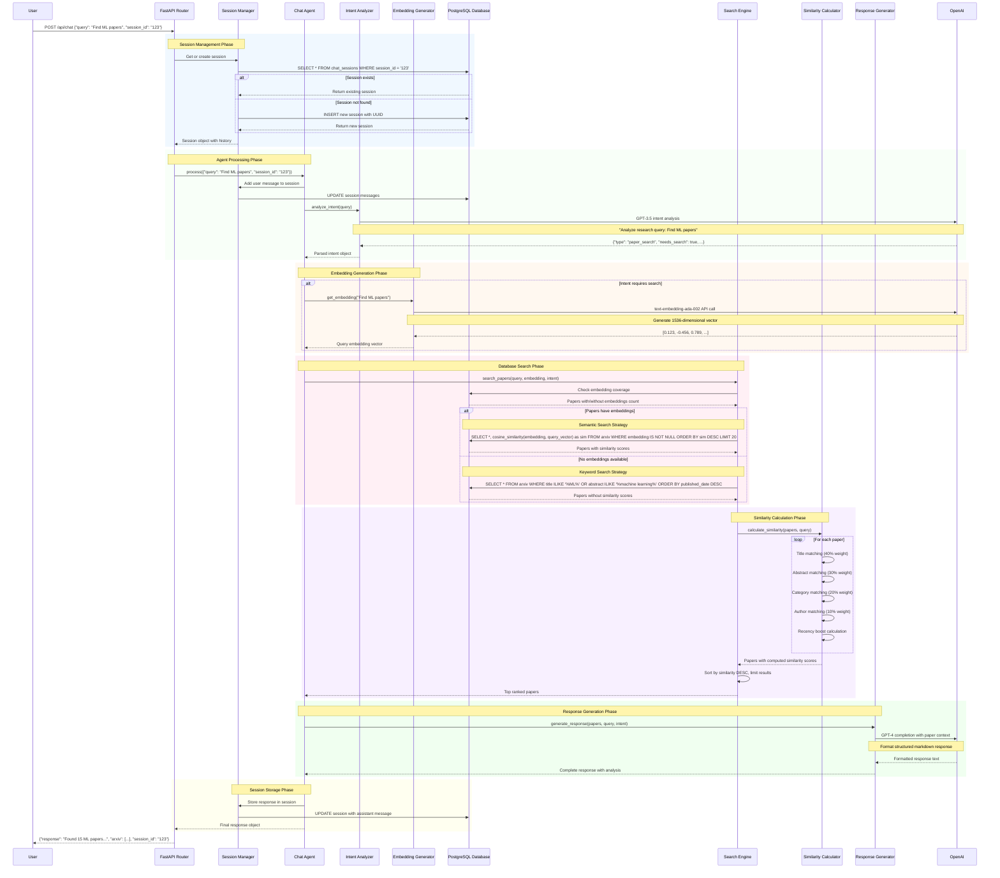
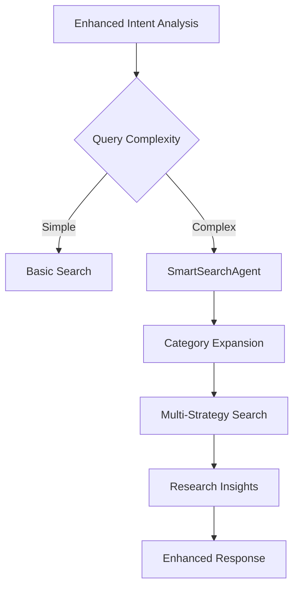
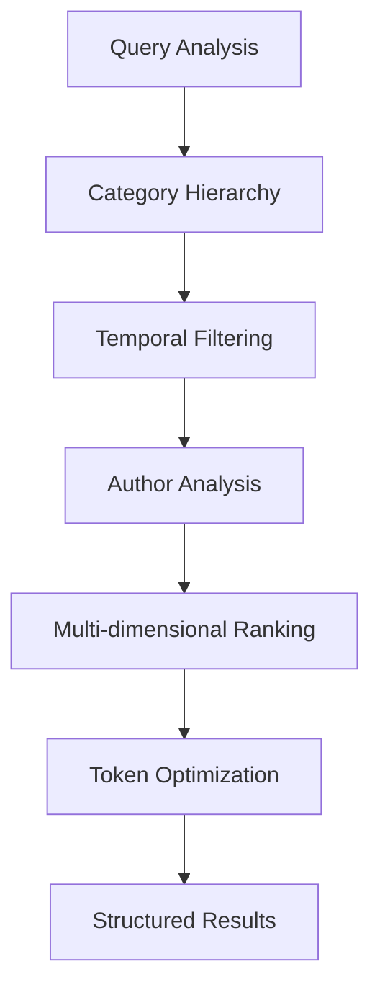

# Complete Chat Workflow - Step by Step

## 🚀 Overview

This document explains the detailed workflow that occurs when a user sends a single chat message through the Research Assistant system. We'll trace every step from the initial API call to the final response.

## 📋 Complete Chat Processing Pipeline

### Step-by-Step Workflow Diagram



## 🔍 Detailed Step Breakdown

### Phase 1: Session Management (Lines 1-15)

**Purpose**: Establish or retrieve user session for conversation continuity.

```python
# What happens in the code:
@app.post("/api/chat")
async def chat(request: ChatRequest):
    with get_db() as db:
        if request.session_id:
            session = db.query(ChatSession).filter(
                ChatSession.session_id == request.session_id
            ).first()
        else:
            session = None
        
        if not session:
            session = ChatSession(
                session_id=str(uuid.uuid4()),
                messages=[],
                context={}
            )
            db.add(session)
            db.commit()
```

**Database Operations**:
- `SELECT * FROM chat_sessions WHERE session_id = ?`
- `INSERT INTO chat_sessions (session_id, messages, context, created_at)` (if new)

**Result**: Session object with conversation history and context.

---

### Phase 2: Intent Analysis (Lines 16-25)

**Purpose**: Understand what the user is asking for and determine processing strategy.

```python
# Agent processes the query
async def _analyze_intent(self, query: str) -> Dict[str, Any]:
    completion = await openai.ChatCompletion.acreate(
        model="gpt-3.5-turbo",
        messages=[
            {"role": "system", "content": CHAT_AGENT_PROMPTS["intent_analysis"]},
            {"role": "user", "content": query}
        ],
        temperature=0.3
    )
```

**OpenAI API Call**:
- **Model**: GPT-3.5-turbo
- **Input**: User query + system prompt
- **Output**: Structured intent analysis

**Example Intent Response**:
```json
{
    "type": "paper_search",
    "needs_search": true,
    "search_params": {
        "categories": ["cs.LG", "stat.ML"],
        "keywords": ["machine learning", "ML"]
    },
    "follow_up_questions": [...]
}
```

---

### Phase 3: Embedding Generation (Lines 26-35)

**Purpose**: Convert user query into vector representation for semantic search.

```python
async def get_embedding(self, text: str) -> List[float]:
    response = await openai.Embedding.acreate(
        model="text-embedding-ada-002",
        input=text
    )
    return response['data'][0]['embedding']
```

**Process Details**:
- **Model**: text-embedding-ada-002
- **Input**: User query text ("Find ML papers")
- **Output**: 1536-dimensional float vector
- **Example**: `[0.123, -0.456, 0.789, ..., 0.321]`

**When Embeddings are Generated**:
- ✅ Always for user queries (for search)
- ✅ For papers (during data ingestion, stored in DB)
- ❌ Not regenerated if already exists

---

### Phase 4: Database Search Strategy (Lines 36-50)

**Purpose**: Find relevant papers using the most effective search strategy.

#### 4A: Semantic Search (When Embeddings Available)

```sql
-- PostgreSQL query with vector similarity
SELECT 
    *,
    cosine_similarity(embedding, '[0.123,-0.456,...]'::vector) as similarity
FROM arxiv 
WHERE embedding IS NOT NULL
ORDER BY similarity DESC
LIMIT 20;
```

**Process**:
1. Check embedding coverage: `SELECT COUNT(*) FROM arxiv WHERE embedding IS NOT NULL`
2. If embeddings exist (>0), use vector similarity
3. Calculate cosine similarity between query and paper embeddings
4. Return papers sorted by semantic similarity

#### 4B: Keyword Search (Fallback Strategy)

```sql
-- Fallback when no embeddings available
SELECT * FROM arxiv 
WHERE 
    title ILIKE '%machine learning%' OR 
    title ILIKE '%ML%' OR
    abstract ILIKE '%machine learning%' OR
    abstract ILIKE '%ML%'
ORDER BY published_date DESC
LIMIT 20;
```

**Process**:
1. Extract keywords from query using intent analysis
2. Search in title and abstract fields
3. Use ILIKE for case-insensitive matching
4. Sort by recency (published_date) as fallback ranking

---

### Phase 5: Similarity Calculation (Lines 51-65)

**Purpose**: Calculate comprehensive relevance scores for ranking papers.

```python
def _calculate_keyword_similarity(self, query: str, paper: Arxiv) -> float:
    # Multi-factor similarity calculation
    title_score = 0.0      # 40% weight
    abstract_score = 0.0   # 30% weight  
    category_score = 0.0   # 20% weight
    author_score = 0.0     # 10% weight
    recency_score = 0.0    # Bonus points
    
    # Calculate each component...
    final_score = (
        title_score * 0.4 + 
        abstract_score * 0.3 + 
        category_score * 0.2 + 
        author_score * 0.1 +
        recency_score * 0.1
    )
    return final_score
```

**Scoring Components**:

1. **Title Matching (40%)**:
   - Exact keyword matches
   - Partial word matches
   - Position-based weighting (early words = higher score)

2. **Abstract Matching (30%)**:
   - Keyword density calculation
   - Context-aware matching
   - Early occurrence bonus

3. **Category Matching (20%)**:
   - Direct category matches
   - Hierarchical category relationships
   - Field-specific bonuses

4. **Author Matching (10%)**:
   - Author name matches
   - Collaboration detection

5. **Recency Bonus**:
   - Newer papers get slight boost
   - Configurable decay function

---

### Phase 6: Response Generation (Lines 66-75)

**Purpose**: Create structured, informative response with paper analysis.

```python
async def generate_completion(self, papers: List[Dict], query: str):
    completion = await openai.ChatCompletion.acreate(
        model="gpt-4",
        messages=[
            {"role": "system", "content": CHAT_AGENT_PROMPTS["system"]},
            {"role": "user", "content": format_paper_context(papers, query)}
        ],
        temperature=0.7
    )
```

**Context Preparation**:
- Paper titles, authors, abstracts (truncated)
- Similarity scores and categories
- Query analysis results
- Response formatting instructions

**Response Format**:
```markdown
## 📚 Research Summary
Brief overview of findings...

## 🔍 Key Papers
1. **Paper Title** by *Authors*: Brief description
2. **Another Paper** by *Authors*: Brief description

## 💡 Insights & Patterns
- Research trends observed
- Common methodologies
- Notable authors/institutions

## 🎯 Next Steps
Suggestions for further research...
```

---

### Phase 7: Session Storage (Lines 76-85)

**Purpose**: Store conversation for future context and user session management.

```python
# Update session with new messages
session.messages.append({
    "role": "user",
    "content": query,
    "timestamp": datetime.utcnow().isoformat()
})

session.messages.append({
    "role": "assistant", 
    "content": response,
    "html_content": html_response,
    "timestamp": datetime.utcnow().isoformat()
})

session.context = {
    "arxiv": papers,
    "intent": intent_analysis
}
```

**Database Update**:
```sql
UPDATE chat_sessions 
SET 
    messages = ?,
    context = ?,
    updated_at = NOW()
WHERE session_id = ?
```

---

## 🔄 Alternative Workflow Paths

### Enhanced Chat Workflow

For `/enhanced-chat` endpoint, additional steps include:



### Smart Search Workflow

For `/smart-search` endpoint:



## ⚡ Performance Considerations

### Database Optimization
- **Indexes**: Composite indexes on `(published_date, categories)`, `(title, abstract)`
- **Vector Operations**: Efficient cosine similarity using pgvector
- **Connection Pooling**: Reuse database connections

### Token Management
- **Input Truncation**: Limit paper context to prevent token overflow
- **Smart Summarization**: Truncate abstracts while preserving key information
- **Response Optimization**: Balance detail vs. token efficiency

### Caching Strategy
- **Session Caching**: Keep recent sessions in memory
- **Embedding Caching**: Store query embeddings temporarily
- **Intent Caching**: Cache intent analysis for similar queries

---

## 🚨 Error Handling

### Common Failure Points

1. **OpenAI API Failures**:
   - Fallback to keyword search if embedding fails
   - Retry logic with exponential backoff
   - Default responses for completion failures

2. **Database Connection Issues**:
   - Connection pool management
   - Transaction rollback on failures
   - Graceful degradation

3. **Empty Results**:
   - Automatic query expansion
   - Alternative search strategies
   - Helpful "no results" responses

### Recovery Mechanisms

```python
try:
    # Primary workflow
    embedding = await self.get_embedding(query)
    papers = await self.search_with_embedding(embedding)
except OpenAIError:
    # Fallback to keyword search
    papers = await self.search_with_keywords(query)
except DatabaseError:
    # Return cached or default response
    return self.default_error_response()
```

---

This complete workflow ensures robust, intelligent paper search and response generation while handling various edge cases and optimization requirements. 