# Focused Agent Workflow - Key Components

## 🎯 Core Flow: User → Chat Agent → Response Agent → Database

This document explains how the 5 key components work together when processing a user's research query.

## 📋 Component Interaction Flow

```mermaid
sequenceDiagram
    participant U as 👤 User
    participant CA as 🤖 Chat Agent
    participant RA as 📝 Response Agent  
    participant EM as 🧮 Embedding Service
    participant DB as 🗄️ PostgreSQL Database

    U->>CA: "Find papers about transformers"
    
    rect rgb(240, 248, 255)
        Note over CA: Chat Agent Processing
        CA->>CA: Analyze intent & extract keywords
        CA->>EM: Generate query embedding
        EM->>EM: Convert "transformers" to vector [0.1, -0.5, 0.8...]
        EM-->>CA: Return 1536-dim embedding vector
    end
    
    rect rgb(255, 248, 240)  
        Note over CA,DB: Database Similarity Search
        CA->>DB: Search with embedding + keywords
        
        alt Papers have embeddings
            DB->>DB: Calculate cosine_similarity(query_vector, paper_vectors)
            DB-->>CA: Papers ranked by semantic similarity
        else No embeddings available
            DB->>DB: Keyword search in title/abstract  
            DB-->>CA: Papers ranked by keyword matches
        end
    end
    
    rect rgb(248, 255, 248)
        Note over CA,RA: Response Generation
        CA->>RA: Send papers + query + analysis
        RA->>RA: Analyze papers & extract insights
        RA->>RA: Generate structured response
        RA-->>CA: Formatted response with analysis
    end
    
    CA-->>U: "Found 15 transformer papers with insights..."
```



## 🔍 Component Deep Dive

### 1. **👤 User Input**
**Role**: Initiates the research query
**Input Example**: *"Find recent papers about transformer models in NLP"*
**What it provides**:
- Research question or topic
- Optional filters (year, category, author)
- Context from previous conversation

---

### 2. **🤖 Chat Agent** (`ChatAgent.process()`)
**Role**: Central coordinator and query processor

#### **What Chat Agent Does**:
```python
async def process(self, input_data):
    # Step 1: Understand user intent
    intent = await self._analyze_intent(query)
    
    # Step 2: Generate embedding for semantic search  
    if intent.get("needs_search"):
        embedding = await self.get_embedding(query)
    
    # Step 3: Search database with multiple strategies
    papers = await self._search_papers(query, embedding, intent)
    
    # Step 4: Calculate similarity scores
    papers_with_scores = self._calculate_similarity(papers, query)
    
    # Step 5: Send to Response Agent
    response_data = await response_agent.process({
        "query": query,
        "arxiv": papers_with_scores,
        "search_context": intent
    })
    
    return response_data
```

#### **Key Responsibilities**:
- 🧠 **Intent Analysis**: Understanding what user wants
- 🔄 **Orchestration**: Coordinating between components  
- 🎯 **Search Strategy**: Deciding how to search (semantic vs keyword)
- 📊 **Similarity Scoring**: Ranking papers by relevance

---

### 3. **🧮 Embedding Service** (OpenAI Integration)
**Role**: Convert text to numerical vectors for semantic search

#### **The Embedding Process**:
```python
# User query: "transformer models for NLP"
query_text = "transformer models for NLP" 

# OpenAI API call
response = await openai.Embedding.acreate(
    model="text-embedding-ada-002",
    input=query_text
)

# Result: 1536-dimensional vector
embedding = [0.123, -0.456, 0.789, 0.234, ..., -0.123]
```

#### **How Embeddings Work**:
1. **Text → Numbers**: Converts words into mathematical vectors
2. **Semantic Meaning**: Similar topics get similar numbers
3. **Comparison Ready**: Vectors can be compared using cosine similarity

**Example**:
- `"transformer models"` → `[0.1, -0.5, 0.8, ...]`
- `"attention mechanisms"` → `[0.2, -0.4, 0.7, ...]` (similar numbers!)
- `"quantum computing"` → `[-0.8, 0.9, -0.3, ...]` (very different numbers)

---

### 4. **🗄️ Database Query Similarity**
**Role**: Find and rank papers based on similarity

#### **Two Search Strategies**:

##### **A. Semantic Search** (When embeddings available)
```sql
-- Find papers using vector similarity
SELECT 
    arxiv.*,
    cosine_similarity(arxiv.embedding, '[0.123,-0.456,0.789,...]'::vector) as similarity_score
FROM arxiv 
WHERE embedding IS NOT NULL
ORDER BY similarity_score DESC
LIMIT 20;
```

**How it works**:
- Compares query embedding with each paper's stored embedding
- Calculates cosine similarity (0.0 to 1.0 scale)
- Higher score = more semantically similar
- Returns papers ranked by AI understanding, not just keywords

##### **B. Keyword Search** (Fallback strategy)
```sql  
-- Fallback when no embeddings available
SELECT arxiv.* FROM arxiv
WHERE 
    title ILIKE '%transformer%' OR 
    abstract ILIKE '%transformer%' OR
    title ILIKE '%attention%' OR
    abstract ILIKE '%attention%'
ORDER BY published_date DESC
LIMIT 20;
```

**How it works**:
- Extracts important keywords from query
- Searches in paper titles and abstracts
- Uses fuzzy matching (ILIKE)
- Ranks by publication date as secondary criteria

#### **Similarity Score Calculation**:
```python
def calculate_final_similarity(paper, query, embedding_sim=None):
    scores = {
        "semantic": embedding_sim or 0.0,      # AI similarity (0-1)
        "title": title_keyword_match(paper),    # Title matching (0-1)  
        "abstract": abstract_keyword_match(paper), # Abstract matching (0-1)
        "category": category_match(paper),      # Category relevance (0-1)
        "recency": recency_boost(paper)         # Publication date bonus
    }
    
    # Weighted combination
    final_score = (
        scores["semantic"] * 0.4 +      # 40% - AI understanding
        scores["title"] * 0.3 +         # 30% - Title relevance  
        scores["abstract"] * 0.2 +      # 20% - Content relevance
        scores["category"] * 0.05 +     # 5% - Field matching
        scores["recency"] * 0.05        # 5% - Freshness bonus
    )
    
    return final_score
```

---

### 5. **📝 Response Agent** (`ResponseAgent.process()`)
**Role**: Analyze papers and generate intelligent responses

#### **What Response Agent Does**:
```python
async def process(self, input_data):
    query = input_data["query"]
    papers = input_data["arxiv"]  # Papers with similarity scores
    
    # Step 1: Analyze the paper collection
    analysis = await self._analyze_arxiv(papers, query)
    
    # Step 2: Determine response type
    analysis_type = self._determine_analysis_type(query)
    
    # Step 3: Generate contextual response
    response = await self._generate_response(papers, query, analysis, analysis_type)
    
    return {
        "response": response,
        "arxiv": papers,
        "analysis": analysis
    }
```

#### **Analysis Capabilities**:
```python
# Response Agent analyzes:
analysis = {
    "total_papers": 15,
    "year_range": {"min": 2020, "max": 2024},
    "top_categories": [
        {"category": "cs.CL", "count": 8},  # Natural Language Processing
        {"category": "cs.LG", "count": 5},  # Machine Learning  
        {"category": "cs.AI", "count": 2}   # Artificial Intelligence
    ],
    "trending_years": [
        {"year": 2023, "count": 7},
        {"year": 2024, "count": 5},  
        {"year": 2022, "count": 3}
    ],
    "has_embeddings": True
}
```

#### **Response Types**:
- **Paper Search**: List of relevant papers with summaries
- **Trend Analysis**: Patterns and trends in the research area
- **Category Analysis**: Deep dive into specific research fields
- **Yearly Summary**: Research progress over time

---

## 🔄 Complete Flow Example

### **User Query**: *"Find transformer papers from 2023"*

1. **👤 User** sends query to API endpoint

2. **🤖 Chat Agent** receives and processes:
   ```python
   intent = {"type": "paper_search", "year": 2023, "topic": "transformer"}
   ```

3. **🧮 Embedding Service** converts query:
   ```python
   embedding = [0.123, -0.456, 0.789, ..., 0.321]  # 1536 dimensions
   ```

4. **🗄️ Database** executes search:
   ```sql
   SELECT *, cosine_similarity(embedding, query_vector) as sim
   FROM arxiv 
   WHERE EXTRACT(YEAR FROM published_date) = 2023 
   AND embedding IS NOT NULL
   ORDER BY sim DESC LIMIT 20;
   ```

5. **📝 Response Agent** analyzes and formats:
   ```markdown
   ## 📚 Transformer Papers from 2023
   Found 18 papers about transformer architectures published in 2023.
   
   ### 🔍 Key Papers:
   1. **"Attention Is All You Need v2.0"** by *Smith et al.*
   2. **"Efficient Transformers Survey"** by *Johnson et al.*
   
   ### 💡 Insights:
   - 67% focus on efficiency improvements
   - 33% explore new attention mechanisms
   ```

6. **👤 User** receives structured response with relevant papers

---

## 🎯 Key Benefits of This Architecture

### **🧠 Intelligence**
- **Chat Agent**: Understands user intent and context
- **Embeddings**: Captures semantic meaning beyond keywords
- **Response Agent**: Provides insights, not just paper lists

### **🔍 Accuracy** 
- **Multi-strategy Search**: Semantic + keyword + metadata
- **Weighted Scoring**: Balances different relevance factors
- **Fallback Mechanisms**: Works even without embeddings

### **📈 Scalability**
- **Component Separation**: Each agent has clear responsibilities
- **Database Optimization**: Efficient vector operations
- **Caching**: Reuse embeddings and analysis results

This focused architecture ensures accurate, intelligent responses while maintaining system efficiency and reliability. 