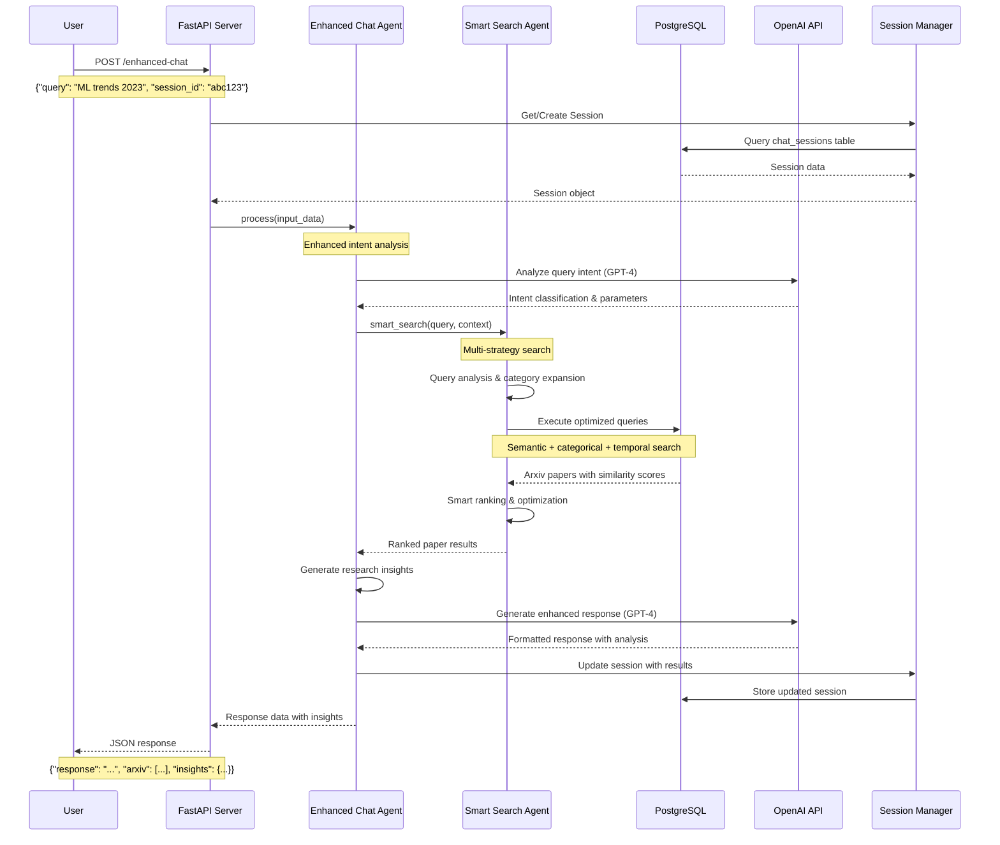

# Research Assistant Backend - Usage Guide

## 🚀 Quick Start

### Starting the Server
```bash
cd backend
pip install -r requirements.txt
uvicorn main:app --host 0.0.0.0 --port 8001 --reload
```

The API will be available at `http://localhost:8001`

## 🔄 API Request/Response Flow

The following sequence diagram shows how a typical enhanced chat request flows through the system:



## 📡 API Usage Examples

### 1. Basic Chat (`/api/chat`)

**Use Case**: Simple question-answer interactions with basic paper search.

```bash
curl -X POST "http://localhost:8001/api/chat" \
  -H "Content-Type: application/json" \
  -d '{
    "query": "Find papers about neural networks from 2023",
    "session_id": "user-session-123"
  }'
```

**Response Features**:
- Basic intent analysis
- Simple paper search
- Session management
- Structured markdown response

### 2. Enhanced Chat (`/enhanced-chat`)

**Use Case**: Advanced research queries with intelligent analysis and insights.

```bash
curl -X POST "http://localhost:8001/enhanced-chat" \
  -H "Content-Type: application/json" \
  -d '{
    "query": "What are the latest trends in transformer architectures for NLP?",
    "context": {"analysis_type": "trend_analysis"},
    "session_id": "research-session-456"
  }'
```

**Response Features**:
- Advanced intent analysis using GPT-4
- Multi-strategy smart search
- Research insights and trend analysis
- Rich HTML and markdown formatting
- Comprehensive paper analysis

### 3. Smart Search (`/smart-search`)

**Use Case**: Direct access to sophisticated search capabilities.

```bash
curl -X POST "http://localhost:8001/smart-search" \
  -H "Content-Type: application/json" \
  -d '{
    "query": "quantum computing applications in cryptography",
    "intent": {
      "categories": ["cs.CR", "quant-ph"],
      "temporal_scope": "recent",
      "search_strategy": "hybrid"
    }
  }'
```

**Response Features**:
- Category hierarchy expansion
- Multi-dimensional search
- Smart ranking algorithms
- Token-optimized results

### 4. Research Landscape (`/research-landscape`)

**Use Case**: Comprehensive analysis of research areas and trends.

```bash
curl -X POST "http://localhost:8001/research-landscape" \
  -H "Content-Type: application/json" \
  -d '{
    "category": "cs.LG",
    "years": [2022, 2023]
  }'
```

**Features**:
- Field analysis and trends
- Author collaboration networks
- Temporal pattern analysis
- Research gap identification

## 🔍 Query Types and Examples

### 1. Paper Search Queries

**Basic Search**:
```
"Find papers about machine learning"
```

**Time-Specific**:
```
"Recent advances in deep learning from 2023"
"Computer vision papers published this year"
```

**Category-Specific**:
```
"cs.LG papers on reinforcement learning"
"Mathematics papers in algebra"
```

**Author-Focused**:
```
"Papers by Geoffrey Hinton on neural networks"
"Collaboration between DeepMind researchers"
```

### 2. Trend Analysis Queries

**Trending Topics**:
```
"What are the most popular research topics in AI?"
"Emerging trends in quantum computing"
```

**Temporal Analysis**:
```
"How has transformer research evolved over the past 5 years?"
"Compare machine learning research between 2020 and 2023"
```

**Field Evolution**:
```
"Evolution of computer vision techniques"
"Historical development of cryptographic methods"
```

### 3. Comparative Analysis Queries

**Method Comparison**:
```
"Compare different attention mechanisms in transformers"
"Comparison of GAN vs VAE approaches"
```

**Field Comparison**:
```
"Differences between theoretical and applied machine learning"
"Computer vision vs natural language processing trends"
```

### 4. Exploratory Queries

**Field Exploration**:
```
"Introduce me to quantum machine learning"
"What is computational biology about?"
```

**Research Gaps**:
```
"What are the open problems in federated learning?"
"Underexplored areas in computer graphics"
```

## 🎯 Agent Selection Guide

### When to Use ChatAgent (`/api/chat`)
✅ **Good for**:
- Simple question-answer interactions
- Basic paper searches
- Straightforward information retrieval
- Quick responses without deep analysis

❌ **Not ideal for**:
- Complex trend analysis
- Multi-dimensional research insights
- Comparative studies
- Advanced categorization needs

### When to Use EnhancedChatAgent (`/enhanced-chat`)
✅ **Good for**:
- Research trend analysis
- Comprehensive field exploration
- Author and collaboration analysis
- Complex comparative studies
- Detailed research insights
- Multi-faceted queries

❌ **Not ideal for**:
- Simple factual questions
- Quick lookups
- When you need just paper lists without analysis

### When to Use SmartSearchAgent (`/smart-search`)
✅ **Good for**:
- Precise paper discovery
- Category-based searches
- Temporal analysis
- Custom search strategies
- Direct access to search algorithms

❌ **Not ideal for**:
- Conversational interactions
- When you need formatted responses
- General research questions

## 📊 Understanding Response Formats

### Basic Response Structure
```json
{
  "response": "Formatted markdown response",
  "html_response": "HTML formatted response", 
  "arxiv": [
    {
      "title": "Paper Title",
      "authors": ["Author 1", "Author 2"],
      "abstract": "Paper abstract...",
      "categories": ["cs.LG", "stat.ML"],
      "published_date": "2023-01-15",
      "similarity": 0.85
    }
  ],
  "intent": {
    "query_type": "trend_analysis",
    "search_strategy": "hybrid",
    "complexity_level": "moderate"
  },
  "session_id": "user-session-123"
}
```

### Enhanced Response with Insights
```json
{
  "response": "Detailed analysis...",
  "arxiv": [...],
  "intent": {
    "insights": {
      "trend_analysis": {...},
      "research_landscape": {...},
      "category_analysis": {...}
    }
  },
  "metadata": {
    "papers_found": 25,
    "search_strategy": "hybrid",
    "categories_analyzed": ["cs.LG", "cs.AI"]
  }
}
```

## 🛠️ Advanced Features

### Session Management
```python
# Sessions automatically track conversation context
# Each user gets a unique session_id for maintaining state
session_data = {
    "session_id": "user-session-123",
    "messages": [...],
    "context": {
        "arxiv": [...],  # Previous search results
        "intent": {...}   # Previous query analysis
    }
}
```

### Context-Aware Queries
```bash
# First query establishes context
curl -X POST "/enhanced-chat" -d '{
  "query": "Find papers about neural networks",
  "session_id": "session-123"
}'

# Follow-up queries use established context
curl -X POST "/enhanced-chat" -d '{
  "query": "Which of these focus on computer vision?",
  "session_id": "session-123"  # Same session
}'
```

### Custom Search Strategies

**Semantic Search** (when embeddings available):
```json
{
  "intent": {
    "search_strategy": "semantic",
    "similarity_threshold": 0.7
  }
}
```

**Category-Focused Search**:
```json
{
  "intent": {
    "search_strategy": "categorical",
    "categories": ["cs.LG", "stat.ML"],
    "expand_categories": true
  }
}
```

**Temporal Analysis**:
```json
{
  "intent": {
    "search_strategy": "temporal",
    "temporal_scope": "recent",
    "years": [2022, 2023]
  }
}
```

## 🔧 Configuration Tips

### Optimizing for Different Use Cases

**For Research Analysis**:
```python
# Use EnhancedChatAgent with trend analysis
context = {
    "analysis_type": "trend_analysis",
    "depth": "comprehensive",
    "include_insights": true
}
```

**For Quick Searches**:
```python
# Use ChatAgent for faster responses
context = {
    "max_papers": 10,
    "simple_response": true
}
```

**For Academic Research**:
```python
# Use SmartSearchAgent with specific parameters
intent = {
    "search_strategy": "hybrid",
    "categories": ["specific-field"],
    "temporal_scope": "longitudinal",
    "include_embeddings": true
}
```

## 🚨 Common Issues and Solutions

### 1. No Search Results
**Problem**: Query returns empty results
**Solutions**:
- Use broader search terms
- Check category spelling
- Try different time periods
- Use hybrid search strategy

### 2. Low Similarity Scores
**Problem**: Papers have low relevance scores
**Solutions**:
- Ensure embeddings are generated
- Use more specific queries
- Try categorical search instead
- Check query spelling

### 3. Slow Response Times
**Problem**: API responses are slow
**Solutions**:
- Limit result count
- Use basic chat agent for simple queries
- Check database connection
- Monitor token usage

## 📈 Performance Monitoring

### Key Metrics
- Response time per endpoint
- Papers returned per query
- Embedding coverage in database
- Session activity patterns

### Analytics Endpoint
```bash
curl -X GET "http://localhost:8001/search-analytics"
```

Returns database statistics and search capabilities overview.

---

This guide should help you effectively use the Research Assistant backend for various research scenarios and requirements. 